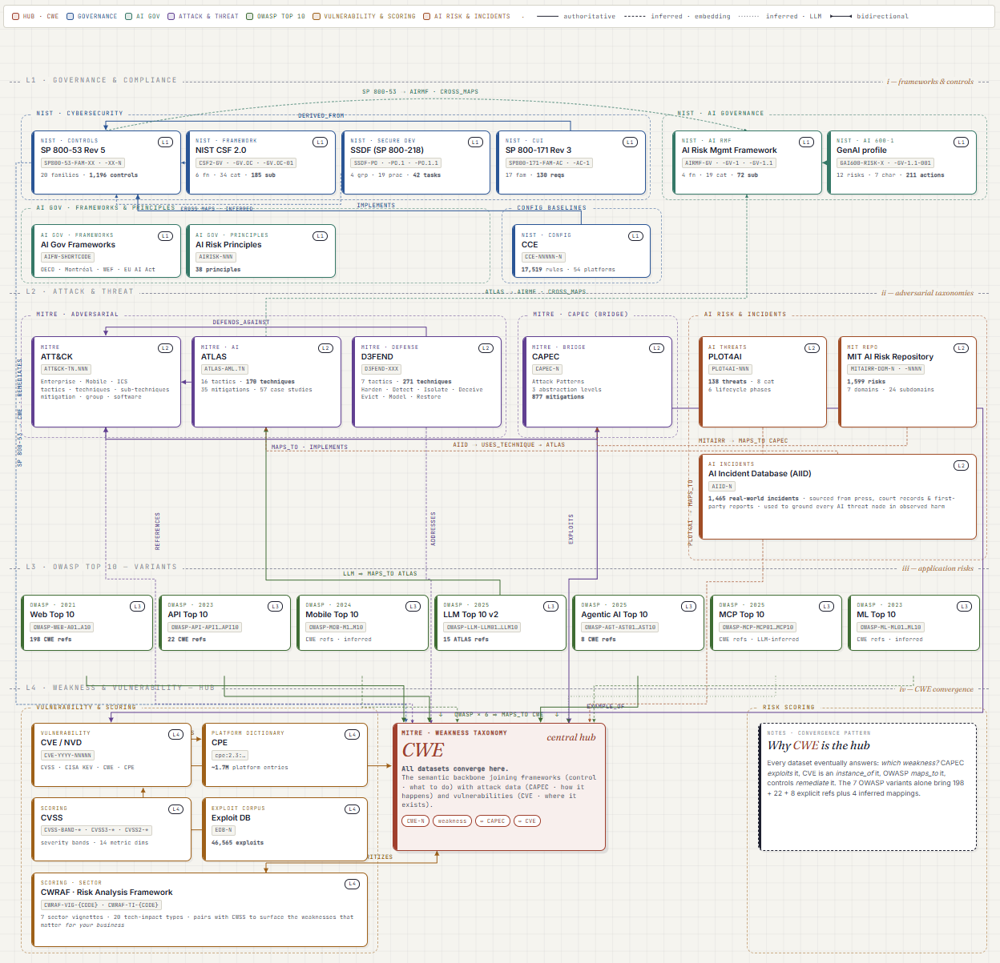

# Content

All material will be subject to publication on [arXiv](https://arxiv.org/) prior to appear on [github](https://github.com/captnjackrackham). Research domains covers:

- **cs.CR** (Cryptography and Security) : Mainly
- **cs.CY** (Computers and Society): Sometimes relevant for papers focusing on the legal, ethical, and human aspects of cybersecurity.
- **cs.AI** (Artificial Intelligence): Often overlaps with papers regarding AI security, governance, and risk management

## T3ZlcnZpZXcgLSBTYWZlIFVzZQ==

This repository is for educational and defensive purposes only. Security material should be tested only in authorized environments, isolated labs, or approved training platforms.

## Seraphim

A cybersecurity ontology (in progress).

