# Q29udGVudA==

## T3ZlcnZpZXcgLSBTYWZlIFVzZQ==

This repository is for educational and defensive purposes only. Security material should be tested only in authorized environments, isolated labs, or approved training platforms.

## Seraphim

A cybersecurity ontology (in progress).

```mermaid
  %%{init: {"theme": "base", "themeVariables": {"fontSize": "13px"}}}%%
  graph TB

      %% =========================================================
      %% GOVERNANCE & COMPLIANCE LAYER
      %% =========================================================
      subgraph GOV["Governance & Compliance Layer"]
          direction LR
          subgraph NIST_CYBER["NIST Cybersecurity"]
              SP80053["SP 800-53 Rev 5\nSP800-53-FAM-XX / SP800-53-XX-N\n20 families · 1,196 controls"]
              CSF2["NIST CSF 2.0\nCSF2-GV / CSF2-GV.OC / CSF2-GV.OC-01\n6 functions · 34 categories · 185 subcategories"]
              SSDF["NIST SSDF (SP 800-218)\nSSDF-PO / SSDF-PO.1 / SSDF-PO.1.1\n4 groups · 19 practices · 42 tasks"]
              SP800171["NIST SP 800-171 Rev 3\nSP800-171-FAM-AC / SP800-171-AC-1\n17 families · 130 requirements"]
          end
          subgraph NIST_AI["NIST AI Governance"]
              AIRMF["NIST AI RMF\nAIRMF-GV / AIRMF-GV-1 / AIRMF-GV-1.1\n4 functions · 19 categories · 72 subcategories"]
              GAI600["NIST AI 600-1 (GenAI)\nGAI600-RISK-X / GAI600-CHAR-X / GAI600-GV-1.1-001\n12 risks · 7 characteristics · 211 actions"]
          end
          subgraph AIFW_GROUP["AI Gov Frameworks"]
              AIFW["AI Gov Frameworks\nAIFW-SHORTCODE\nOECD · Montréal · WEF · EU AI Act"]
              AIRISK["AI Risk Principles\nAIRISK-NNN\n38 principles"]
          end
          CCE["CCE\nCCE-NNNNN-N\n17,519 config rules · 54 platforms"]
      end

      %% =========================================================
      %% ATTACK & THREAT LAYER
      %% =========================================================
      subgraph ATK["Attack & Threat Layer"]
          direction LR
          subgraph MITRE_ATK["MITRE Adversarial"]
              ATTCK["MITRE ATT&CK\nATT&CK-TN.NNN\nEnterprise + Mobile + ICS\ntactics · techniques · sub-techniques\nmitigation · group · software"]
              ATLAS["MITRE ATLAS\nATLAS-AML.TN\n16 tactics · 170 techniques\n35 mitigations · 57 case studies"]
              D3FEND["MITRE D3FEND\nD3FEND-XXX\n7 tactics · 271 techniques\nHarden/Detect/Isolate/Deceive/Evict/Model/Restore"]
          end
          subgraph CAPEC_BOX["MITRE CAPEC (bridge)"]
              CAPEC["MITRE CAPEC\nCAPEC-N\nAttack Patterns\n3 abstraction levels\n877 mitigations"]
          end
          subgraph AI_RISK_BOX["AI Risk & Incidents"]
              PLOT4AI["PLOT4AI\nPLOT4AI-NNN / PLOT4AI-CAT-N\n138 AI threats · 8 categories\n6 lifecycle phases"]
              MITAIRR["MIT AI Risk Repository\nMITAIRR-DOM-N / MITAIRR-SUB-N.M / MITAIRR-NNNN\n1,599 risks · 7 domains · 24 subdomains"]
              AIID["AI Incident Database\nAIID-N\n1,465 incidents"]
          end
      end

      %% =========================================================
      %% OWASP LAYER
      %% =========================================================
      subgraph OWASP_LAYER["OWASP Top 10 Variants"]
          direction LR
          OWASPW["OWASP Web 2021\nOWASP-WEB-A01…A10\n198 CWE refs"]
          OWASPA["OWASP API 2023\nOWASP-API-API1…API10\n22 CWE refs"]
          OWASPM["OWASP Mobile 2024\nOWASP-MOB-M1…M10"]
          OWASPL["OWASP LLM v2.0 2025\nOWASP-LLM-LLM01…LLM10\n15 ATLAS refs"]
          OWASPAG["OWASP Agentic AI 2025\nOWASP-AGT-AST01…AST10\n8 CWE refs"]
          OWASPMCP["OWASP MCP 2025\nOWASP-MCP-MCP01…MCP10"]
          OWASPML["OWASP ML 2023\nOWASP-ML-ML01…ML10"]
      end

      %% =========================================================
      %% WEAKNESS & VULNERABILITY HUB
      %% =========================================================
      subgraph VUL["Weakness & Vulnerability Layer"]
          direction LR
          CWE["CWE  ← HUB →\nCWE-N\nWeakness taxonomy\nAll datasets converge here"]
          subgraph VULN_TOOLS["Vulnerability & Scoring"]
              CVE["CVE / NVD\nCVE-YYYY-NNNNN\nCVSS · CISA KEV · CWE · CPE"]
              CPE["CPE Dictionary\ncpe:2.3:...\n~1.7M platform entries"]
              CVSS["CVSS\nCVSS-BAND-* / CVSS3-* / CVSS2-*\nSeverity bands · 14 metric dimensions"]
              EDB["Exploit DB\nEDB-N\n46,565 exploits"]
          end
          subgraph RISK_SCORING["Risk Scoring"]
              CWRAF["CWRAF\nCWRAF-VIG-{CODE} / CWRAF-TI-{CODE}\n7 sector vignettes · 20 tech impact types"]
          end
      end

      %% =========================================================
      %% CROSS-DATASET EDGES
      %% =========================================================

      %% --- Governance → SP 800-53 ---
      SP800171 -->|"derived_from\n(authoritative · 157 edges)"| SP80053
      CSF2 -.->|"cross_maps\n(inferred:embedding)"| SP80053
      SSDF -.->|"cross_maps\n(inferred:embedding)"| SP80053
      CCE -->|"implements\n(authoritative)"| SP80053

      %% --- AI Governance internal ---
      GAI600 -->|"part_of\n(authoritative)"| AIRMF
      GAI600 -->|"addresses\n(authoritative)"| GAI600
      GAI600 -->|"has_characteristic\n(authoritative)"| GAI600

      %% --- NIST AI RMF ← cross-maps ---
      ATLAS -.->|"cross_maps\n(inferred:embedding)"| AIRMF
      SP80053 -.->|"cross_maps\n(inferred:embedding)"| AIRMF

      %% --- ATT&CK ↔ CAPEC ---
      CAPEC <-->|"maps_to / implements\n(authoritative)"| ATTCK

      %% --- ATLAS mirrors ATT&CK ---
      ATLAS -->|"mirrors\n(authoritative)"| ATTCK

      %% --- D3FEND defends ---
      D3FEND -->|"defends_against\n(authoritative)"| ATTCK
      D3FEND -.->|"addresses\n(inferred:embedding)"| CWE

      %% --- CAPEC → CWE ---
      CAPEC -->|"exploits\n(authoritative)"| CWE

      %% --- ATT&CK → CWE ---
      ATTCK -.->|"references\n(authoritative where present)"| CWE

      %% --- CAPEC → CVE ---
      CAPEC -->|"example_of\n(authoritative)"| CVE

      %% --- OWASP → CWE / CAPEC / ATLAS ---
      OWASPW -->|"maps_to CWE\n(authoritative)"| CWE
      OWASPA -->|"maps_to CWE\n(authoritative)"| CWE
      OWASPAG -->|"maps_to CWE\n(authoritative)"| CWE
      OWASPM -.->|"maps_to CWE\n(inferred:embedding)"| CWE
      OWASPML -.->|"maps_to CWE\n(inferred:embedding)"| CWE
      OWASPMCP -.->|"maps_to CWE\n(inferred:llm)"| CWE
      OWASPL -->|"maps_to ATLAS\n(authoritative)"| ATLAS

      %% --- CVE ecosystem ---
      CVE -->|"instance_of\n(authoritative)"| CWE
      CVE -->|"affects\n(authoritative)"| CPE
      EDB -->|"targets\n(authoritative)"| CVE

      %% --- SP 800-53 → CWE ---
      SP80053 -.->|"remediates\n(inferred:embedding)"| CWE

      %% --- CWRAF / CWSS ---
      CWE -->|"has_consequence\n(authoritative)"| CWRAF
      CWRAF -.->|"prioritizes\n(inferred:embedding)"| CWE

      %% --- AI Risk → tech layer ---
      PLOT4AI -.->|"maps_to CWE/CAPEC\n(inferred:embedding)"| CWE
      MITAIRR -.->|"maps_to CAPEC/ATLAS\n(inferred:embedding)"| CAPEC
      AIID -.->|"uses_technique\n(inferred:embedding)"| ATLAS
      AIID -.->|"example_of\n(inferred:embedding)"| CAPEC

      %% =========================================================
      %% STYLES
      %% =========================================================
      classDef hub fill:#c0392b,color:#fff,stroke:#922b21,font-weight:bold
      classDef gov fill:#2980b9,color:#fff,stroke:#1a5276
      classDef attack fill:#8e44ad,color:#fff,stroke:#6c3483
      classDef owasp fill:#27ae60,color:#fff,stroke:#1e8449
      classDef vuln fill:#e67e22,color:#fff,stroke:#ca6f1e
      classDef ai fill:#16a085,color:#fff,stroke:#0e6655
      classDef risk fill:#d35400,color:#fff,stroke:#a04000

      class CWE hub
      class SP80053,CSF2,SSDF,SP800171,CCE gov
      class AIRMF,GAI600,AIFW,AIRISK ai
      class ATTCK,ATLAS,D3FEND,CAPEC attack
      class OWASPW,OWASPA,OWASPM,OWASPL,OWASPAG,OWASPMCP,OWASPML owasp
      class CVE,CPE,CVSS,EDB vuln
      class CWRAF,PLOT4AI,MITAIRR,AIID risk

```

